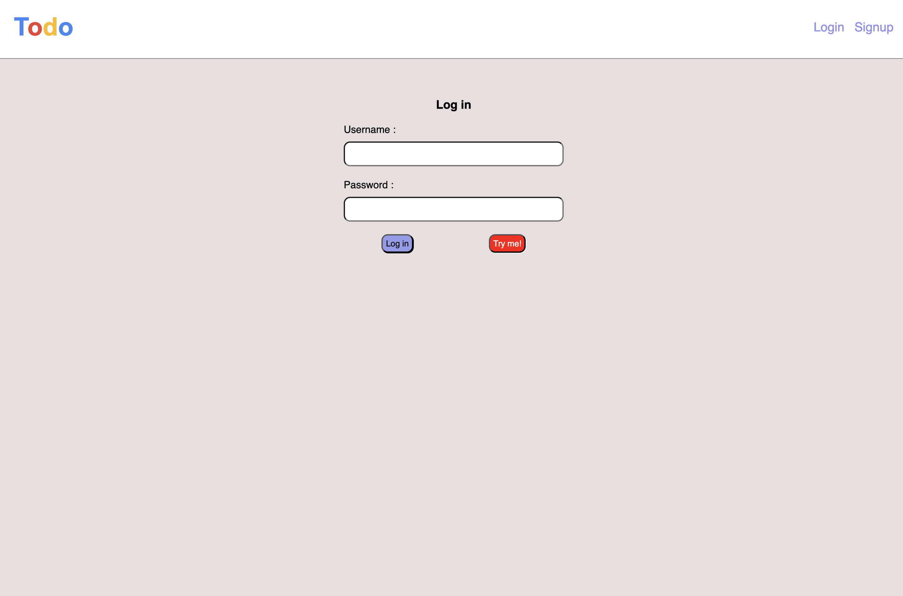
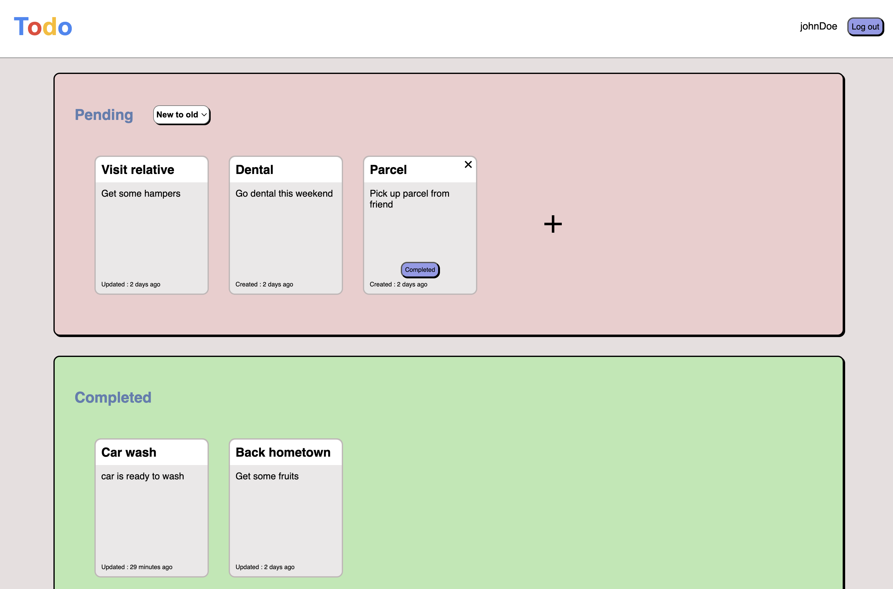

# Todo App (MERN Stack)

A full-stack Todo App built using MongoDB, Express.js, React.js, and Node.js (MERN).

## Table of Contents

- [Demo](#demo)
- [Features](#features)
- [Technologies](#technologies)
- [Getting Started](#getting-started)
- [Setting Up the Project](#setting-up-the-project)
- [Overview](#overview)

## Demo

You can check the app live at: [**Live Todo App Demo**](https://whatodos.vercel.app/login)

## Features

- Create, Read, Update, and Delete (CRUD) Todos
- User authentication
- Mark todos as completed or pending
- Responsive UI
- Persistent data with MongoDB

## Technologies

- **Frontend:** React.js
- **Backend:** Node.js, Express.js
- **Database:** MongoDB

## Getting Started

To run this project locally, follow these instructions.

### Prerequisites

Before you begin, make sure you have the following installed:

- [Node.js](https://nodejs.org/en/) (LTS version recommended)
- [npm](https://www.npmjs.com/)
- [MongoDB](https://www.mongodb.com/)

### Setting Up the Project

1. **Clone the repository**  
   Click the button to copy the clone command:

   ```
   git clone https://github.com/your-username/todo-app.git
   ```

2. **Navigate to the project directory**

   ```
   cd todolist
   ```

3. **Install backend dependencies**
   (Make sure you are in the root of the project directory)

    ```
    npm install
    ```
4. **Navigate to the frontend folder and isntall frontend dependency**

   ```
   cd frontend
   npm install
   ```

5. **Set up environment variables**

   Create a .env file in the root directory amd add the following:
   ```
   MONGODB_URI={your mongodb string here}
   PORT={your recommended port eg. 3000}
   ```

6. **Run the development server(backend)**

   ```
   npm start
   ```

7. **Run the development server(frontend)**

   ```
   npm start
   ```

8. **Open the app**

   Visit http://localhost:3000 in your browser to view the app


### Overview

Login page for the todoApp, click the "tryMe!" button for guestLogin




User can add new todo simply by click the "+" sign and fill in all the data. Once completed, user can mark the todo as completed when hover over the todo. User can even change the details inside by just clicking at the targeted element or click "x" button to delete todo.


